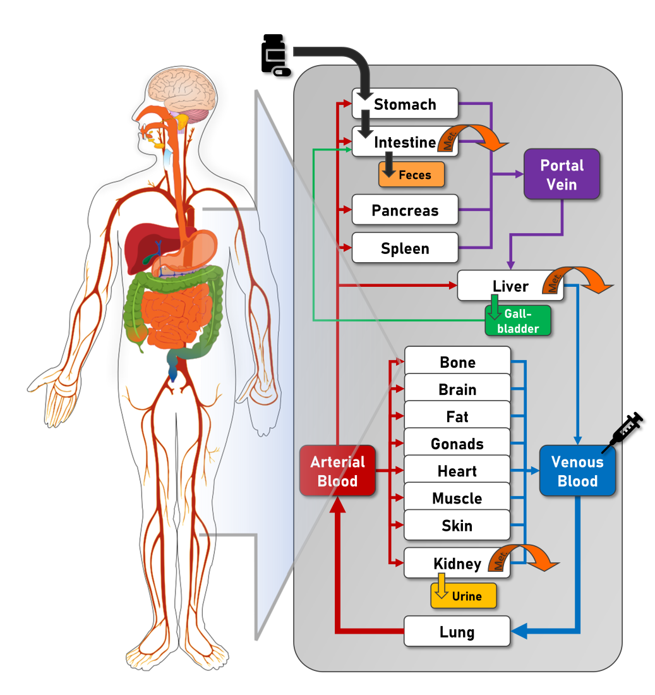

Open Systems Pharmacology Suite (OSP suite) is a tool for PBPK modeling and simulation of drugs in laboratory animals and humans. PK-Sim® and MoBi® are part of the OSP suite [[1](#references)].  PK-Sim® is based on a generic PBPK-model with 18 organs and tissues. One of the main assumptions is that all compartments are well-stirred. Represented organs/tissues include arterial and venous blood, adipose tissue (separable adipose, excluding yellow marrow), brain, lung, bone (including yellow marrow), gonads, heart, kidneys, large intestine, liver, muscle, portal vein, pancreas, skin, small intestine, spleen and stomach, as shown in **Figure 1**.

Each organ consists of four sub-compartments namely the plasma, blood cells (which together build the vascular space), interstitial space, and cellular space. Distribution between the plasma and blood cells as well as between the interstitial and cellular compartments can be permeability-limited. In the brain, the permeation barrier is located between the vascular and the interstitial space. PK-Sim® estimates model parameters (intestinal permeability [[2](#references)] organ partition coefficients (tissue-to-plasma partition coefficients) [[3,4](#references)], and permeabilities) from physico-chemical properties of compounds (molecular weight, pKa, acid/base properties) and the composition of each tissue compartment (lipids, water and proteins). Partition coefficients can be calculated using a variety of methods available in PK-Sim®, for example the internal PK-Sim® method [[3,4](#references)] or that of Rodgers and Rowland [[5-7](#references)]. 

Physiological databases included in the software incorporate the dependencies of organ composition, organ weights, organ blood flows and gastrointestinal parameters (gastrointestinal length, radius of each section, intestinal surface area, gastrointestinal transit times, and pH in different intestinal segments [[2](#references)]), with the user-defined body weight and height and ethnicity of the individual [[8](#references)]. Thereby, PK Sim® allows generating realistic virtual populations. For a detailed description of the PBPK model structure implemented in PK Sim®, see Willmann et al. [[2,4,8,9](#references)] or the OSP Suite homepage (<https://docs.open-systems-pharmacology.org/mechanistic-modeling-of-pharmacokinetics-and-dynamics/modeling-concepts>).

**Figure** **1: Structure of the Whole Body PBPK Model integrated in PK-Sim®**

[1] [www.open-systems-pharmacology.org](http://www.open-systems-pharmacology.org/)

[2] [Willmann S, Schmitt W, Keldenich J, Lippert J, Dressman JB. A physiological model for the estimation of the fraction dose absorbed in humans.J Med Chem. 2004 Jul 29;47(16):4022-31.](https://www.ncbi.nlm.nih.gov/pubmed/15267240)

[3] [Haerter MW, K.J., Schmitt W, *Estimation of physicochemical and ADME parameters.* , in *Handbook of Combinatorial Chemistry: Drugs, Catalysts, Materials*, H.W. Nicolaou KC HR, Editor. 2002, Wiley VCH Verlag GmbH: Weinheim, Germany. p. 743-60.](https://onlinelibrary.wiley.com/doi/pdf/10.1002/3527603034.ch26)

[4] [Willmann S, Lippert J, Schmitt W. From physicochemistry to absorption and distribution: predictive mechanistic modelling and computational tools. Expert Opin Drug Metab Toxicol. 2005 Jun;1(1):159-68.](https://www.ncbi.nlm.nih.gov/pubmed/16922658)

[5] [Rodgers, T, D. Leahy, and M. Rowland. Physiologically based pharmacokinetic modeling 1: predicting the tissue distribution of moderate-to-strong bases. J Pharm Sci. 2005 Jun;94(6):1259-76.](https://www.ncbi.nlm.nih.gov/pubmed/15858854)

[6] [Rodgers T, Rowland M. Physiologically based pharmacokinetic modelling 2: predicting the tissue distribution of acids, very weak bases, neutrals and zwitterions. J Pharm Sci. 2006 Jun;95(6):1238-57.](https://www.ncbi.nlm.nih.gov/pubmed/16639716)

[7] [Rodgers T, Rowland M. Mechanistic approaches to volume of distribution predictions: understanding the processes. Pharm Res. 2007 May;24(5):918-33. Epub 2007 Mar 20.](https://www.ncbi.nlm.nih.gov/pubmed/17372687)

[8] [Willmann S, Höhn K, Edginton A, Sevestre M, Solodenko J, Weiss W, Lippert J, Schmitt W. Development of a physiology-based whole-body population model for assessing the influence of individual variability on the pharmacokinetics of drugs. J Pharmacokinet Pharmacodyn. 2007 Jun;34(3):401-31. Epub 2007 Mar 13.](https://www.ncbi.nlm.nih.gov/pubmed/17431751)

[9] [Willmann S, Lippert J, Sevestre M, Solodenko J, Fois F, Schmitt W. PK-Sim®: a physiologically based pharmacokinetic ‘whole-body’ model. Biosilico 2003.1(4):121-24.](https://www.sciencedirect.com/science/article/pii/S1478538203023424?via%3Dihub)

